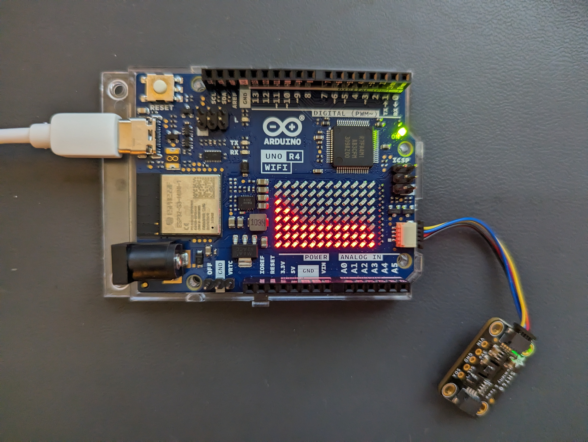

# sht-led-demo-uno-r4
A demo for using the LED Matrix of the Arduino Uno R4 Wifi as a time series graph

## Usage:
Connect your SHT40 to the QWIIC socket on the Arduino. If you're not
using the QWIIC connector, adapt the `SHT_I2C_INTERFACE` variable below

After startup, the lowest row should barely come on. If you blow on the
sensor to warm it up, you should see the signal raise

To reset the baseline value, simply reset the board

## Description:
This is an demo showing how to use the LED matrix of an Arduino Uno R4 
Wifi to display the signal from a Sensirion SHT4x humidity temperature 
sensor
 
The orientation is such that the LED matrix is in landscape orientation, 
meaning that there are 12 values, with a resolution of 8 bars each.
Furthermore, the most recent value is inserted on the right. 'Right' in
this case is based on the text on the Arduino PCB, i.e. the orientation
is such that the USB port of the board is looking to the left
 
Note that since the vertical resolution is just 8 bars, I've opted to 
choose an initial baseline in the init() function, and only show a 
limited range. The range displayed is defined as
- min value: `BASELINE_SCALE_FACTOR` baseline value
- max value: min value + `TEMP_RANGE`

Note that internally, all values are in degree celsius, although since
the intention is to display the variation, the unit used should have
no practical impact
